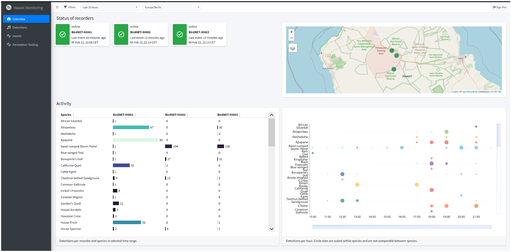

# Real-time frontend in R Shiny

This is an interactive application that provides a real-time frontend for monitoring avian diversity using BirdNET. The application visualizes detections made with solar-powered real-time monitoring units.



## Setup

To set up the application, follow these steps:

1. **Clone the repository:**
   ```sh
   git clone https://github.com/BirdNETPlus/shiny-rtf.git
   cd shiny-rtf
   ```

2. **Install the required R packages:**
   Open R or RStudio and run the following commands:
   ```r
   install.packages("devtools")
   devtools::install_deps()
   ```

3. **Load the package:**
   ```r
   pkgload::load_all(export_all = FALSE, helpers = FALSE, attach_testthat = FALSE)
   ```

## Run

To run the application, use the following command in R or RStudio:
```r
BirdNETmonitor::run_app()
```

Alternatively, you can run the development version with:
```r
source("dev/run_dev.R")
```

## License

This project is licensed under the MIT License. See the [LICENSE](LICENSE) file for details.

## Citation

Feel free to use the code base or parts of it for your own projects. If you use the code for scientific publications, please cite the following paper:

```
@article{weidlichrau2025continuous,
  title={Continuous Real-Time Acoustic Monitoring of Endangered Bird Species in Hawai‘i},
  author={Weidlich-Rau, Melissa and Navine, Amanda K. and Chaopricha, Patrick T. and G{\"u}nther, Felix and Kahl, Stefan and Wilhelm-Stein, Thomas and Mack, Raymond C. and Reers, Hendrik and Rice, Aaron N. and Eibl, Maximilian and Hart, Patrick J. and Wolff, Patrick and Klinck, Holger and Schnell, Lena D. and Doratt, Rogelio and Loquet, Michael and Lackey, Tiana},
  year={2025},
  journal={Ecological Informatics},
  volume={XX},
  number={X},
  pages={XX-XX},
  publisher={Elsevier}
}
```

## Funding

This project is supported by Jake Holshuh (Cornell class of '69) and The Arthur Vining Davis Foundations. Our work in the K. Lisa Yang Center for Conservation Bioacoustics is made possible by the generosity of K. Lisa Yang to advance innovative conservation technologies to inspire and inform the conservation of wildlife and habitats.

The development of BirdNET is supported by the German Federal Ministry of Education and Research through the project “BirdNET+” (FKZ 01|S22072). The German Federal Ministry for the Environment, Nature Conservation and Nuclear Safety contributes through the “DeepBirdDetect” project (FKZ 67KI31040E). In addition, the Deutsche Bundesstiftung Umwelt supports BirdNET through the project “RangerSound” (project 39263/01).

## Partners

BirdNET is a joint effort of partners from academia and industry.
Without these partnerships, this project would not have been possible.
Thank you!

